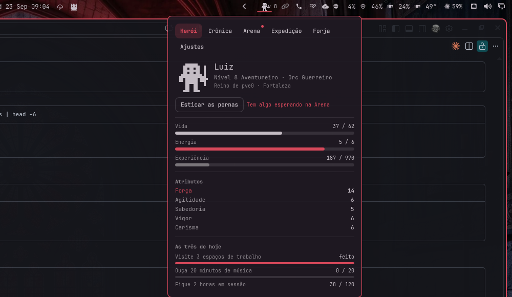
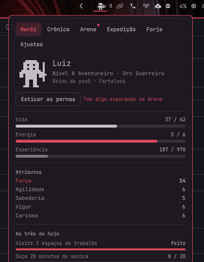
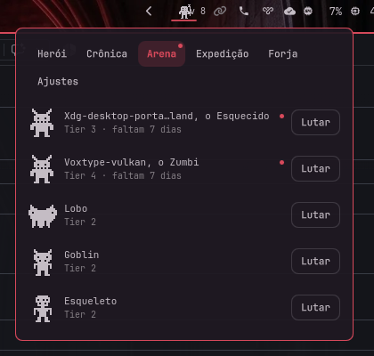
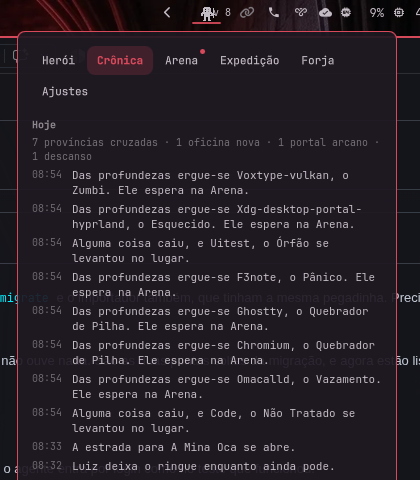
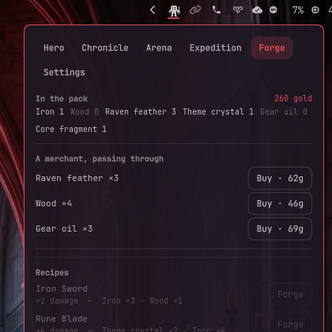

# Omaquest

An offline RPG that lives in the [Omarchy](https://omarchy.org) bar. Your
machine is the realm: workspaces, windows, music, rest and crashes become your
hero's chronicle. Open the panel when you feel like it — fight in the arena,
send an expedition, forge gear. Pick a race and a class.

Never interrupts, never punishes, never touches the network.

| Hero | Arena | Chronicle | Forge |
|---|---|---|---|
|  |  |  |  |

The bosses in that arena are real: `voxtype-vulkan` is tier 4 because it
genuinely crashed three times on the machine these were taken on, and the
plugin grew the boss each time.

## What it is

- A pixel hero on the bar, 1-bit and tinted with your theme, who breathes,
  walks while away, sleeps when you do and cheers on a new level
- Five races and six classes, and the thirty of them look different
- A chronicle written from what actually happens on your desktop
- **When a program on your machine crashes, it becomes a boss** named after it,
  waiting in the arena. Crashing again makes it angrier
- An arena, expeditions that survive the machine being off, a forge, and a
  merchant who passes through with three things a day
- Three quests a day, a Seal, a streak that forgives two missed days
- A walk across your screen whenever you ask for one, with a flourish at the
  far end that looks different for every class
- Potions worth deciding about, and a plucked theme while you fight — if you
  switch sound on, which is off by default
- English and Brazilian Portuguese
- Zero network, zero dependencies beyond Omarchy itself

## What it never does

It does not decay or nag. It does not open its own panel or need a keyboard.
It sends at most **two notifications a day** in total, and every category can
be switched off. It is silent unless you switch sound on, and then only during
a fight and for a level or a find.

Leave for a month and your hero is exactly where you left them, with full
energy.

**Losing a fight costs progress, never achievement.** You drop a quarter of the
experience you had built toward the level you are on — enough for the arena to
matter — and nothing else: never a level, a title, gold, a material, an item,
or a feat. Nothing you have earned can be taken away; what you can lose is an
afternoon.

## Requirements

Omarchy 4.x (Quattro) with `omarchy-shell`. Nothing else.

`coredumpctl` (systemd) is used if it is there; without it there are simply no
crash bosses. `git` is only used if you switch the commit sensor on.

## Install

    omarchy plugin add https://github.com/f360c4/omaquest.git --enable

The installer only clones files and validates the manifest — it never runs code
from the plugin. Omit `--enable` to read the code first, then
`omarchy plugin enable f360c4.omaquest`.

## Remove

    omarchy plugin remove f360c4.omaquest

Your save stays in `~/.local/state/omaquest/`; delete that folder to be rid of
it entirely.

## What it reads, exactly

Counts and states. Never content.

| What | How | What is kept |
|---|---|---|
| The workspace you are on | `Quickshell.Hyprland`, the `focusedWorkspace` property | Which workspace numbers you visited today, and how many. |
| Windows opening | `Quickshell.Hyprland` raw events, `openwindow` only | How many windows, how many distinct applications, how many were terminals. **The application class is read to answer those two questions and then dropped — it never reaches disk. The window title is never read at all.** |
| Whether you are at the machine | `IdleMonitor` (Wayland, through Quickshell) | Minutes at the keyboard, and when you rested. |
| Whether something is playing | `Quickshell.Services.Mpris`, `playbackState` only | Minutes of music. **Never the title, the artist, or which player.** |
| Your theme's colours | The shell's own `Color` singleton | That the theme changed. The colours themselves only tint the hero. |
| Battery, if there is one | `Quickshell.Services.UPower` | Whether it ran flat and came back. A desktop has no battery and no weather. |
| Programs that crashed | `coredumpctl list --json=short --no-pager --since @<timestamp>`, every 15 minutes | The **basename of the executable**, which becomes the boss's name, and when. Crashes owned by other users are skipped. **The core file is never opened, the command line is never read, no backtrace is ever taken.** |
| AI agent usage — **opt-in, off by default** | Files under `~/.local/state/omarchy/agents/usage/`, each through `head -c 65536` | A token total. **Never a prompt, never an answer, and never the help or status text those files also carry.** |
| Commits — **opt-in, off by default** | `find ~/Work -maxdepth 2 -name .git -type d`, then `git -C <repo> rev-list --count --since=@<ts> HEAD` per repository, every 30 minutes | A number. **Never a message, a file name, an author, or the name of a repository.** |
| Its own settings | The plugin's inline entry in `~/.config/omarchy/shell.json`, through the shell's API | Language and the switches below. |
| Its own save | `~/.local/state/omaquest/save.json` and `chronicle.json`, through `head -c 262144` so the read is bounded whatever the file has become | The hero. |

## What it executes, exactly

Every external command, in full. All of them are argument vectors whose values
are constants or paths derived from `$HOME` and `$XDG_STATE_HOME`. **Never a
shell, never a string concatenated from anything.**

| Command | When |
|---|---|
| `mkdir -p ~/.local/state/omaquest` | Once at startup |
| `head -c 262144 <save>`, then the same for `<chronicle>` | Once at startup |
| `id -u` | Once at startup, to know whose crashes are yours |
| `coredumpctl --version` | Once at startup, to know whether the crash sensor can work |
| `which omarchy` | Once at startup, to know whether the Bard button can exist |
| `mv <save> <save>.corrupt-<timestamp>.json` | Only when the save cannot be parsed |
| `coredumpctl list --json=short --no-pager --since @<ts>` | Every 15 minutes, if `coredumpctl` is there |
| `omarchy-notification-send --app-name omaquest …` | At most twice a day, only for categories left switched on |
| `ls -1 <agents/usage>`, then `head -c 65536 <file>` | Every 15 minutes, **only if you switch the agent sensor on** |
| `find ~/Work …`, then `git -C <repo> rev-list --count …` | Every 30 minutes, **only if you switch the commit sensor on** |
| `mkdir -p <state>/bard` and `omarchy agent prompt "<fixed text>"` | **Only when you click "Ask the Bard"**, at most once a day, and only if you switched the Bard on |
| `pw-play --volume <v> assets/sounds/<file>.wav` | **Only if you switch sound on**, and then only during a fight or for a level or a find |

Never `notify-send` (the Omarchy notification server drops it), never `curl`,
`wget` or any network tool, never `sudo` or `pkexec`, never `bash -c`.

## What it writes

`~/.local/state/omaquest/` and nowhere else:

- `save.json` — the hero. Written atomically, at most once every five seconds
  however much happens. A maximal save is under 64 KiB by design, and the test
  suite holds it to that.
- `chronicle.json` — the last 300 entries, pruned on every append.
- `bard/brief.md` — a short, readable summary of your last day, written when
  you click the Bard so that your agent has one small text file to read
  instead of the save.
- `bard/YYYY-MM-DD.md` — written by **your** agent, only if you enable the Bard
  and click the button.

Plus its own settings entry in `~/.config/omarchy/shell.json`, through the
shell's API, which only lets a plugin write its own.

## The Bard (optional AI)

Off by default, and the only path to a language model in the whole plugin.

When enabled, the Chronicle tab gains one button. It writes a short brief —
your hero in a line, and the last day's chronicle already rendered as sentences
— and then runs `omarchy agent prompt` with a fixed instruction: read that one
file, write about 150 words in the panel's language, save it beside the brief,
touch nothing else.

The agent never opens your save. It reads a page of prose the plugin wrote for
it, which is both faster than asking it to infer a JSON schema and less to hand
over. It uses your default agent and your quota. **Nothing runs without the
click**, at most once a day, and the plugin never decides to spend a token on
its own.

The button is hidden entirely if `omarchy` is not on your PATH.

`skills/omaquest-bard/SKILL.md` carries the same instruction, if you would
rather ask your agent directly.

## Settings

| Setting | Default | What it does |
|---|---|---|
| `language` | `auto` | Panel language. Auto follows `$LANG` and falls back to English. |
| `showLevel` | off | Adds `Lv N` beside the sprite on horizontal bars. |
| `sound` | **off** | `off`, `quiet` or `full`. A plucked theme during a fight, one note for a level or a find, and nothing else, ever. |
| `notifyLevelUp` | **on** | One notification when the hero reaches a new level. |
| `notifyBoss` | **on** | One notification when something rises in the arena. |
| `notifyExpedition` | off | When an expedition is home. |
| `notifyQuests` | off | When the day's three quests are done. |
| `sensorAgents` | off | The AI agent token sensor described above. |
| `sensorGit` | off | The commit sensor described above. |
| `bardEnabled` | off | The Bard button described above. |

Two notifications a day in total, regardless of what is switched on. Anything
over that is dropped in silence rather than queued.

## Security notes

The plugin runs unsandboxed inside `omarchy-shell`, like every Omarchy plugin.
It opens no sockets, adds no service or unit, needs no privileges, installs
nothing, and every external command it runs is listed above with its exact
arguments.

**Nothing that accumulates is unbounded.** Compositor events are folded into
counters as they arrive rather than queued, so a burst has no list to grow. The
day's workspace ids cap at 32 and its seen applications at 256; pending lists
at 32; active bosses at 3; the chest at 60 items; the fight log at 4 lines; the
chronicle at 300 entries; agent files at 16 and repositories at 30, both read
one at a time. Every file read goes through `head -c`.

**The one string taken from outside and kept** is a crashed executable's
basename. It is truncated to 32 characters where it enters and again where it
is loaded, and it is rendered as plain text — the panel uses `Text.PlainText`
everywhere, so no name from this machine can become markup.

**Sprites are plain-text grids** under `assets/sprites/`, and **the audio is
generated from code** by `tools/make-sounds.py` — a plucked string built out of
about fifteen lines of arithmetic. Nothing was recorded or downloaded, and
there is no sample whose origin anybody has to take on trust. The only binaries
in the repository are the preview images and those generated `.wav` files.

To see what the plugin currently knows:

    omarchy-shell f360c4.omaquest status

It prints levels, counts and sensor states as JSON, and nothing it would not
show you in the panel.

## How it was made

Written by Luiz Felipe with coding agents and language models doing a great
deal of the typing, over one long session. That arrangement shows up in the
repository in ways worth knowing about if you are reading the code:

- The rules are pure JavaScript with no Qt in them, and there are 127 tests
  over them, because an agent that cannot run what it wrote is guessing.
- `tools/balance.js` exists because the combat numbers in the original design
  did not survive being measured — a level 1 hero won 100% of its fights, and
  by level 16 the win rate ran from 0% for a bard to 71% for a rogue. The
  constants in the class table are that tool's output, not anybody's guess.
- `tools/security-check.sh` and `tools/check-sprites.sh` exist because both
  caught real bugs the moment they were written: a rule that silently checked
  nothing, a crash sensor that switched itself off within the hour, and two
  sprites that were never drawn so every boss rendered as empty space.
- `docs/decisions.md` records every place the implementation diverges from the
  design it started with, and why, including the measurements.

## Is it light?

Too light to measure against the shell it runs inside, which is the honest
answer and a better one than a decimal.

Three paired four-minute windows on a two-monitor desk carrying a dozen bar
plugins gave 8.45%, 19.45% and 5.42% of a core with Omaquest enabled, against
9.16%, 9.93% and 10.04% with it disabled — one pair came back *lower* with it
on. Memory: 509 MB with, 517 MB without. The shell moves more between windows
than the plugin could add.

What can be stated exactly is the work, and `tools/weight.sh` prints it from
the source: one 60-second tick, three single-shot debounces, a sprite frame
flip that swaps which of two pre-built layers is visible and allocates
nothing, and one `coredumpctl` every fifteen minutes. Nothing at all runs
before there is a hero. The same script fails the build if a new timer ever
runs faster than that budget.

## Building on it

    node tests/rules.test.js      # the rules, 99 tests, no Qt involved
    node tools/balance.js         # measures the arena; --tune recalibrates it
    ./tools/weight.sh             # what runs and how often; --memory measures RSS
    ./tools/security-check.sh     # the release checklist, as a command
    ./tools/lint.sh               # qmllint against the installed shell
    ./tools/check-i18n.sh         # every language carries exactly en.json's keys
    ./tools/check-sprites.sh      # every grid is 16x16 and in the index

`game/*.js` is the whole rule set as pure JavaScript with no Qt in it, which is
why it is testable under plain node. `docs/architecture.md` is the short
version of how the pieces fit. `docs/decisions.md` records where this diverges
from its own specification and why — including the combat numbers, which did
not survive being measured.

Translations are welcome: copy `i18n/en.json`, translate the values, add the
code to `manifest.json`, and run `./tools/check-i18n.sh`.

## Alternatives

[Omagotchi](https://github.com/jacob-vincent-mink/omagotchi) is a pet you look
after. DevQuest gives experience for git commits. Omaquest is for people who
want a character, a story told out of their own desktop, and something to play
for two minutes.

## License

MIT. See [LICENSE](LICENSE).
